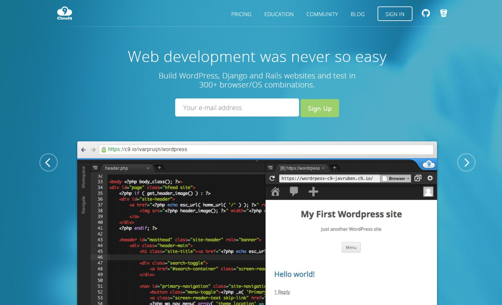
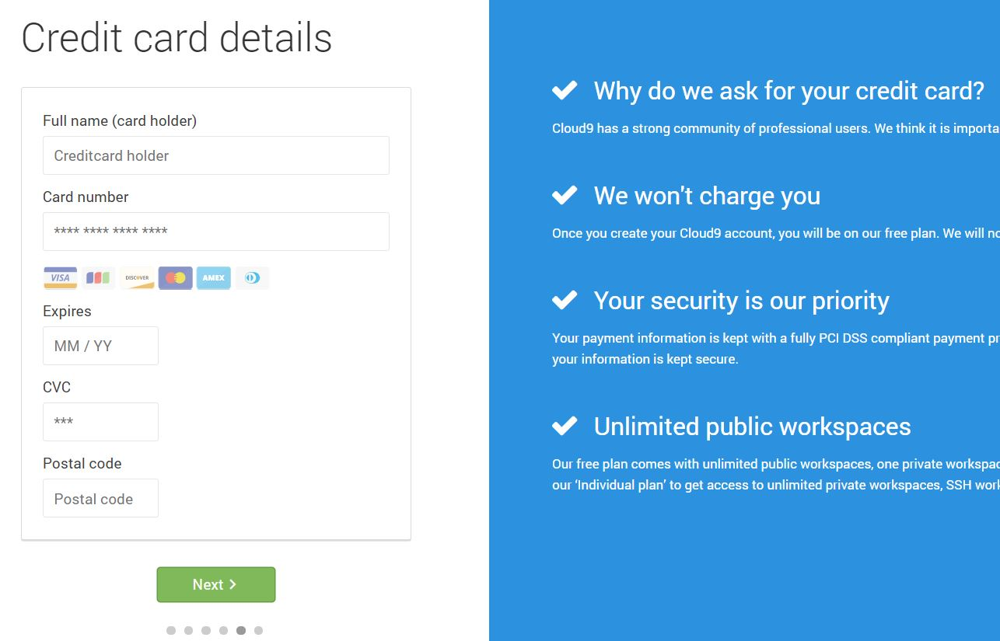
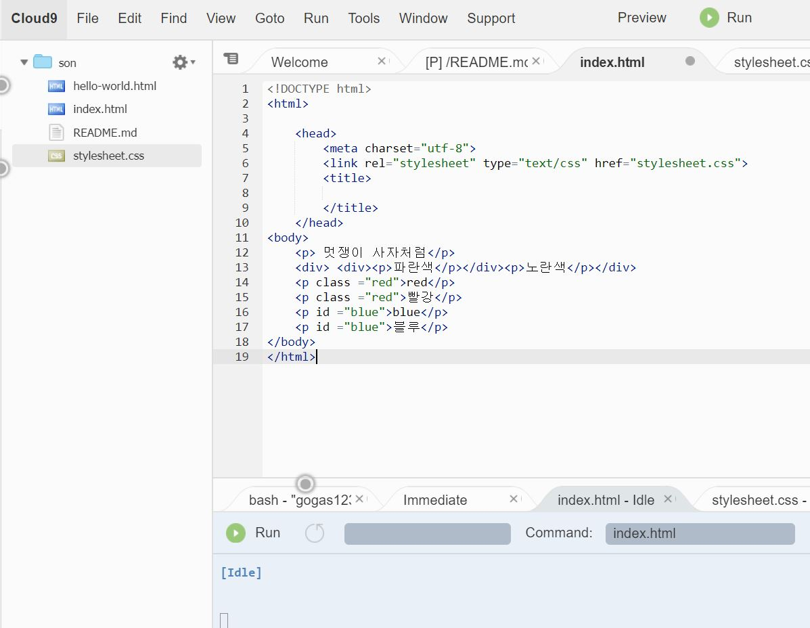

 
 
 

# 가상 개발 도구 C9

- 앞에서 말한 환경구축에서 Node.js를 이용해서 하는 방법도 있지만 이는 다른 사람들과 협업을 할 때 여러 문제가 생긴다. Github을 이용한 소스 공유도 있지만 이는 일반 E-mail로도 할 수 있는 일들이다. 더욱 더 효과적인 작업을 할려면 가상 개발 도구 C9을 이용해서 할 수 있다. C9은 부분유료화 Tool로써 가상 개발 환경을 구축한다. 심지어 원격 저장소의 기능도 하기 때문에 협업을 할 때도 상당히 편하다. 대부분 bootstrap을 이용한 작업을 하게되면 C9으로 하는 것이 훨씬 편할 것이다. 협업에 특화되어 있고 바로 호스팅도 가능하기 때문에 실시간으로 현재 사이트의 상태를 확인 할 수가 있다.
 
 
 
    - 차례  
          
       -C9 회원 가입
        
        

       -C9 환경 구축
        
   -C9 협업 방법
        
     -C9 bootstrap 적용
 
 
    - 주의 사항
 
 

   1. C9 회원가입
 
 
    - http://c9.io 가 C9의 공식 주소이다. 우선 회원가입을 해주면된다. 하지만 회원 가입시 VISA카드가 필요하니 꼭 챙겨야 하며 우편번호가 필요하다. 우편번호는 해당 C9이 주소를 확인 할 때 필요하기 때문이다.

 
 
    -  ↓C9의 초기화면
 
 

   

 
 

-  ↓ C9의 회원가입 시 VISA카드 제시 화면

 
 

   

  

    2. C9 환경구축
 
    - 회원가입이 되었다면 이제 생성을 해보면 되는데 간단히 설명하면 작은 서버를 하나 만드는 것과 같다.
  

-  ↓ C9 Workspace 구축 장면(Create a new Workspace+ 를 눌러주면된다)
 
 

   
  
 
-  ↓ C9 Workspace 구축 장면(공개 권한 및 사용할 랭귀지 등을 설정 할 수 있다.)
   
   
   
-  ↓ C9 Workspace 구축 장면(Create workspace를 누르면 가상 서버가 구축 중인 상태)   

   
   
-  ↓ C9 Workspace 구축 완료(구축 후 간단한 HTML언어를 사용하여 소스입력)   

   
   

   3. C9 협업 방법   

    - 현재는 이제 간단한 가상 서버 환경 구축과 간단한 소스 입력을 해보았으나 사실 상 1인 개발은 힘들기 때문에 협업을 하게 되는데 이러한 협업에 관한 설명을 아래에서 다룬다.미리 하나 기본형으로 만들어 둔 뒤에 동료의 C9 계정을 추가하여 권한을 부여하는 것이 일반적인 방법이다. 
        
    * 아래 사진은 이미 기본형을 만들고 동료의 계정 까지 추가한 상태이다.
   
-  ↓ C9 Workspace 협업하기(기본 탭에서 Shared With Me를 클릭)
   

   

   
-  ↓ C9 Workspace 협업하기(아래와 같이 소스를 입력하면 실시간으로 코드 라인 숫자 옆에 색상으로 누가 코드를 작성했는지 알 수 있게 되어있으며 마우스를 대고 있으면 해당 작성자의 이름이 나온다.)
 
 

   
   
   4. bootstrap

    - 앞의 내용을 읽어 보았다면 현재 bootstrap 파일들이 pc에는 설치 되어있지만 C9의 가상 환경에는 적용이 되어있지 않은 상태이다. 이러한 상태에서 설명한다.
 
    -  ↓ C9 Workspace bootstrap 적용하기(몹시 간단하다 설치된 파일들을 드래그 해서 해당 기본 탭에 넣어주면 된다.)
   

   
   
    -  ↓ C9 Workspace bootstrap 적용하기(동료들과 소스를 만든 후 지금의 상태를 확인하고 싶다면 위에 RUN이라고 적힌 버튼을 클릭하면 서버가 구동된다. 그리고 콘솔 창이 아래와 같이 변한다.)
  
   
        
    -  ↑ C9 Workspace bootstrap 적용하기(위 와같이 변하면 링크가 하나 생기는데 이것이 가상 호스팅인데 저 것을 클릭하면 현재 상태를 확인 할 수있다. 또한 저 콘솔 창에 여러가지 명령어로 Back-end 부분 명령을 내릴 수 도 있다.)
   
    -  ↓ C9 Workspace bootstrap 적용하기( 아래는 CSS,HTML등 소스를 입력 후 Run을 돌렸을때의 모습이다.)
   
   
       
-  ↑ 위의 사진은 직접 제작한 사이트 이기 때문에 문제가 없습니다.
   
- 주의 사항 
   
우선 기본적인 환경 구성을 작성 하였으나. 우선 C9 기능을 사용하기 위해선 어느 정도 PC의 사양이 받쳐주어야 한다. 그리고 충분한 개발 언어의 숙련도만 있으면 쉽게 이용 할 수 있다.