
  # 2015008 김진모
 
 
  

* **목차**
  * [1.](#1.) CSS
    * [1.1.](#1.1.) CSS 기본설정
    * [1.2.](#1.2.) 모바일 우선기능
    * [1.3.](#1.3.) CSS 사용
  * [2.](#2.) bootstrap CSS 기반
    * [2.1.](#2.1.) LESS
  * [3.](#3.) Bootstrap 프레임워크 CSS 기능
  * [4.](#4.) 그리드 시스템
  * [4.1.](#4.1.) Bootstrap의 그리드 시스템의 작동 방식
  * [4.2.](#4.2.) 그리드 시스템 응용
  * [4.2.1.](#4.2.1.)그리드 시스템 응용(- visble-*)
  * [4.2.2.](#4.2.2.)그리드 시스템 응용(- clearfix)
  * [4.2.3.](#4.2.3.)그리드 시스템 응용(- offset)
  * [4.2.3.](#4.2.4.)그리드 시스템 응용(pull, push)
 
 
 
 
 
---

## [1.](#TOC) <a id="1.">CSS</a>
##### CSS 기능을 이용하기 위해서는 기본적으로 HTML5를 사용해야 한다.

### [1.1.](#TOC) <a id="1.1.">CSS 기본설정</a>
##### 그러기 위해서는 DOCTYPE에 대해서 HTML5로 정의해야 한다. 가장 위에 문서 양식은 아래와 같이 정의하면 사용할수 있다..
~~~ 
<!DOCTYPE html>
~~~
### [1.2.](#TOC) <a id="1.2.">모바일 우선기능</a>
##### 그리고 Bootstrap 2에서는 모바일은 옵션으로 다루고 있었지만, Bootstrap 3에서는 모바일 우선(mobile first)인 프레임워크로 작성이 되었기 때문에 뷰포트에 대한 메타태그 설정을 하면 좋다. 물론 사이트에 따라서 이러한 뷰포트는 다르게 설정을 해도 되며, 기존의 사이트에 적용하는 경우에는 모바일에 대한 화면의 크기가 달라지기 때문에 예상하지 못하는 문제가 발생할 수 있으므로 조심해야 한다.
~~~
<meta name="viewport" content="width=device-width, initial-scale=1">
~~~
### [1.3.](#TOC) <a id="1.3.">CSS 사용</a>
##### 이후에 ``<head>`` 태그 안에서 CSS 파일을 link 시키면 기본적인 CSS 기능들은 사용할 수 있다. 아래는 CDN에 있는 Bootstrap CSS 파일을 사용하는 것으로, 필요하면 개별적으로 서버에서 다운 받아서 사용하면 된다.
~~~
<link rel="stylesheet" href="https://maxcdn.bootstrapcdn.com/bootstrap/3.3.6/css/bootstrap.min.css" integrity="sha384-1q8mTJOASx8j1Au+a5WDVnPi2lkFfwwEAa8hDDdjZlpLegxhjVME1fgjWPGmkzs7" crossorigin="anonymous">
~~~

 

### [2.](#TOC) <a id=2.>bootstrap CSS 기반</a>
#####   부트스트랩의 CSS 는 Less 를 기반으로 만들어졌습니다. Less 는 CSS 컴파일링을 위한 변수, 믹스인, 함수 같은 부가 기능성을 갖춘 프리프로세서입니다. 컴파일된 CSS 파일들 대신 우리가 프레임워크 내에서 사용한 수많은 변수들과 믹스인들을 활용하는 Less 파일들을 사용하는 것을 고려해 보아야합니다.

### [2.1.](#TOC) <a id=2.1.>LESS</a>
 ##### css는 html을 꾸며주는 언어입니다. 하지만 단점도 있는데요. 이를테면 작성하기는 쉽지만, firebug와 같은 도구 없이는 유지보수하는 것이 매우 어렵습니다. 또 동적인 언어의 특징인 변수나 함수와 같은 특성을 가지고 있지 않기 때문에 많은 양의 코드가 동원되기도 합니다. 이러한 문제를 해결하기 위해서 기술 중의 하나가 lesscss입니다. lesscss를 보다 간결하고 유지보수하기 쉬운 css를 만들 수 있습니다.
>LESS는 NodeJS를 엔진으로 사용한다

 

## [3.](#TOC) <a id="3.">Bootstrap 프레임워크 CSS 기능</a>
##### Bootstrap 프레임워크의 CSS 기능은 웹페이지에 적용하게 되는 CSS 규칙들을 기본적으로 설정하고, 기본 HTML 요소들에 대한 스타일을 적용하는 기능들을 포함하고 있다. 특히, Bootstrap 프레임워크에서 제공해주고 있는 반응형 웹페이지의 가장 큰 기능인 그리드 형식으로 여러 칼럼으로 보여주다가 브라우져의 크기가 작아지면 세로로 나열시키는 기능을 이 CSS 기능에서 적용하면 된다. 양식이나 버튼들에 대해서도 다양한 CSS 설정을 기본적으로 해주니 기본 UI 디자인에서 조금 더 향상된 CSS를 체험할 수 있다.

 

## [4.](#TOC) <a id="4.">그리드 시스템</a>
#### Bootstrap은 기기나 뷰포트 크기가 증가함에 따라 12 열이 적절하게 확대되는 **반응형**, **모바일 우선** 유동 그리드 시스템입니다. 그것은 쉬운 레이아웃을 위해 미리 정해진 클래스들 뿐만 아니라 강력한 더 시멘틱한 레이아웃을 생성하기 위한 믹스인 을 포함하고 있습니다. 
> 그리드 시스템은 콘텐츠를 보관할 행과 열 시리즈를 통해 페이지 레이아웃들 만드는데 사용되어집니다.  

### [4.1.](#TOC) <a id="4.1.">Bootstrap의 그리드 시스템의 작동 방식</a>
- 행은 반드시 적절한 정렬과 패딩을 위해서 .container (fixed-width) 나 .container-fluid (full-width) 안에 위치해야 합니다.
- 열들의 수평그룹을 만드는데 행을 이용하세요.
- 콘텐츠는 열안에 위치해야 합니다. 그리고 열들만이 행의 바로 아래에 올 수 있습니다.
- .row 과 .col-xs-4 같은 사전정의된 그리드 클래스들은 간편하게 그리드 레이아웃 만드는 것을 가능하게 합니다. Less 믹스인은 좀 더 시멘틱한 레이아웃을 위해 사용되어질 수 있습니다.
- 열은 padding 으로 사이 간격을 만듭니다. 패딩은 행 내에서 첫열과 마지막열을 위해 .row 내에 음수 마진으로 offset 되어 있습니다.
- 음수 마진은 아래의 예제들이 내어쓰기가 되어 있는 이유입니다. 그것은 그리드 열 내의 콘텐츠는 비그리드 콘텐츠와 정렬되기 위함입니다.
- 그리드 열은 12개의 가능한 열들을 원하는 만큼 명시하는 것으로 만들어집니다. 예를 들면, 같은 크기의 3개 열은 .col-xs-4 를 3개 사용할 수 있습니다.
- 만약 한 행에 12열보다 더 많이 배치된다면, 남은 열들은, 하나의 유닛으로, 새로운 라인에 감싸집니다.
- 그리드 클래스는 분기점 크기보다 크거나 같은 너비의 화면을 가진 기기에 적용됩니다. 그리고 보다 작은 기기의 그리드 클래스가 오버라이드 됩니다. 그리하여, 예를 들어 요소에 .col-md-* 클래스를 적용하는 것은 중간 기기에 스타일이 효과가 있는 것뿐만 아니라 .col-lg-* 클래스가 없다면 큰 기기에도 효과가 있게 됩니다.

### [4.2.](#TOC) <a id="4.2.">그리드 시스템 응용</a>
##### 위의 row와 col-*은 기본적으로 그리드 시스템에서 사용하면서 발생하는 다양한 추가적인 이슈나 문제들에 대해서 추가적인 기능들을 제공해주고 있습니다. 가장 대표적인 상황이 큰 화면에서는 보여주지만, 작은 화면에서 보여주고 싶지 않은 내용일 것이다. 예를 들어 큰 화면에서는 큰 그림을 보여주지만, 작은 화면에서는 보여주고 싶지 않을 때 이러한 기능을 이용하면 된다. 

### [4.2.1.](#TOC) <a id="4.2.1.">그리드 시스템 응용(- visble-*)</a>
> ###### 아래의 예는 큰 화면에서는 4개의 칼럼으로 보여주다가, 작은 화면에서는 3개의 칼럼만 보여주고자하는 예의 소스이다. 이 경우에는 visible-md 등과 같이 해당 칼럼을 보여주고자 하는 크기를 지정해주면 된다.
~~~
 

  

    
.col-md-3 .col-sm-4
 
    
.col-md-3 .col-sm-4
 
    
.col-md-3 .col-sm-4
 
    
.col-md-3 .visible-md
 
  
 

~~~
##### 위의 소스를 큰 화면에서 보면 아래와 같이 4개의 칼럼이 전부다 나타나는 것을 확인할 수 있다.
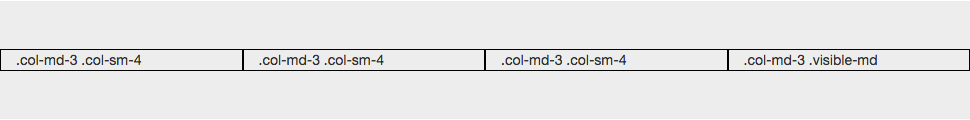
##### 그리고 브라우져의 크기를 줄여보면 아래와 같이 visible-md의 클래스를 설정하였던 칼럼은 없어지고, 나머지 3개의 칼럼만 보여주는 것을 확인할 수 있다. 이 때에 3개의 칼럼을 화면 전체 넓이에 맞게 보여주기 위하여 col-sm-4로 작은 화면에서는 3칼럼으로 보여주도록 함께 설정하였다.
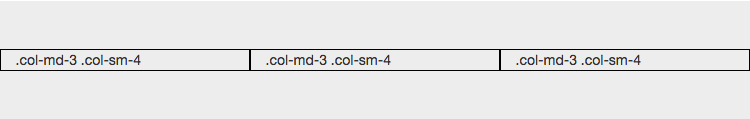

### [4.2.2.](#TOC) <a id="4.2.2.">그리드 시스템 응용(- clearfix)</a>
##### 반응형으로 넓은 화면에서는 여러 개의 칼럼을 하나의 줄로 보여주다가 좁은 화면에서 여러 줄로 나누어서 보여주게 되는 경우 세로 길이가 다르면 약간 어긋나는 상황이 많이 있을 것이다. 대표적인 예가, 큰 화면에서 4칼럼으로 한줄로 보여주다가 작은 화면에서 2칼럼으로 2줄로 보여주는 상황일 것이다. 아래가 그 예이다. 아래는 예 소스이다.

~~~
        

            

                
.col-md-3
.col-sm-6
larger div

                
.col-md-3
.col-sm-6

                
.col-md-3 .col-sm-6

                
.col-md-3 .col-sm-6

            

        

~~~
##### 결과값 : 

~~~
.clearfix:before, 
.clearfix:after,
 /* 생략 */ {
    display: table;
    content: " "; 
} 
 .clearfix:after,
 /* 생략 */ {
    clear: both; 
}
~~~
##### 위와 같이 CSS를 설정하게 되면, CSS의 흐름이 초기화 되도록 하는 방법이다. 이렇게 clearfix를 이용해서 위의 어긋난 칼럼들을 보정하려면 아래와 같이 sm인 경우에 보이도록 하면 된다. 
###### 이를 보정한 예는 아래와 같다.
~~~
        

            

                
.col-md-3
.col-sm-6
larger div

                
.col-md-3
.col-sm-6

                

                
.col-md-3 .col-sm-6

                
.col-md-3 .col-sm-6

            

        

~~~
##### 위와 같이 브라우져크기가 sm 인 경우에만 clearfix를 설정한 
가 보이도록 하고 있다. 이렇게 되면 아래와 같이 작은 브라우져 화면인 경우에 위와는 다르게 어긋나지 않고 윗줄이 동일하게 맞추어졌음을 확인할 수 있다.
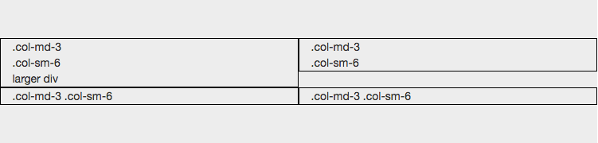
### [4.2.3.](#TOC) <a id="4.2.3.">그리드 시스템 응용(- offset)</a>
##### 칼럼의 왼쪽에 공백을 두고 싶다면 그냥 빈 공백의 `
`를 공백을 두고 싶은 만큼 col-xs-*등을 넣어도 되지만, 이러한 공백의 `
`가 아니라 스타일을 적용함으로써 공백을 둘수도 있다. 이를 위해서 col-sm-offset-1 등과 같이 offset 클래스를 이용하면 된다. 아래는 1개의 칼럼만큼 공백을 두고 5칼럼 크기 만큼을 할당하는 예이다.
~~~

 
  

    
.col-sm-5 .col-sm-offset-1
 
    
.col-sm-5 .col-sm-offset-1
 
  
 

~~~
#####  위는 1칼럼 offset, 5칼럼 내용, 1칼럼 offset, 5칼럼 내용을 넣는 소스이며, 실제로 표시해보면 아래와 같이 작은 화면 이상에서는 그렇게 나타나고 작은 화면에서는 세로로 배치되는 것을 확인할 수 있다.

### [4.2.4.](#TOC) <a id="4.2.4.">그리드 시스템 응용(pull, push)</a>
##### 화면의 크기에 따라서 순서를 바꿔주고 싶다면 pull과 push 클래스를 이용하면 된다. 위의 offset과는 유사하지만, 용도와 내부적인 CSS는 조금 다르다. 
###### 아래는 화면이 md 크기 이상일 때와 sm이하인 경우에 칼럼의 순서를 바꿔주고자 하는 경우의 예이다.
~~~
 

  
 
    
.col-sm-9 .col-md-push-3

    
.col-sm-3 .col-md-pull-9

  
 
 

~~~
##### 위의 소스를 보면 sm 화면 이상에서의 9칼럼 크기 칼럼을 md 이상 화면에서는 push-3을 하고 있고, sm 화면 이상에서 3 칼럼 크기의 카럼을 md 이상 화면에서 pull-9를 설정하였다. pull 클래스는 왼쪽으로 칼럼을 당긴다고 생각하면 되고, push는 칼럼을 오른쪽으로 미는 기능이라고 생각하면 된다. 이에 대하여 실제로 col-sm-9가 앞에 있지만, 중간 화면에서는 아래와 같이 col-sm-3 칼럼이 앞에 있는 것을 확인할 수 있다.
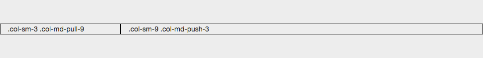

### [5.](#TOC)<a id="5.">Font</a>
##### 모든 HTML 제목인, `<h1>` 부터 `<h6>` 까지 사용가능합니다. 당신의 텍스트를 인라인으로 표시되면서 스타일만 제목 스타일로 맞추기 위해 `.h1` 부터 `.h6` 클래스 또한 사용 가능합니다.

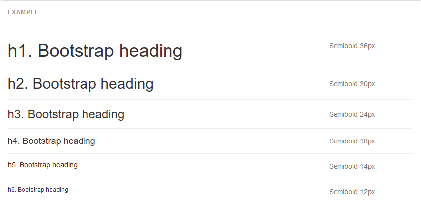

~~~
<h1>h1. Bootstrap heading</h1>
<h2>h2. Bootstrap heading</h2>
<h3>h3. Bootstrap heading</h3>
<h4>h4. Bootstrap heading</h4>
<h5>h5. Bootstrap heading</h5>
<h6>h6. Bootstrap heading</h6>
~~~
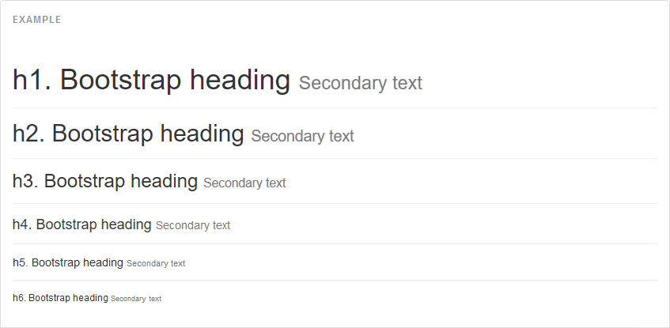
~~~
<h1>h1. Bootstrap heading <small>Secondary text</small></h1>
<h2>h2. Bootstrap heading <small>Secondary text</small></h2>
<h3>h3. Bootstrap heading <small>Secondary text</small></h3>
<h4>h4. Bootstrap heading <small>Secondary text</small></h4>
<h5>h5. Bootstrap heading <small>Secondary text</small></h5>
<h6>h6. Bootstrap heading <small>Secondary text</small></h6>
~~~
### [5.1.](#TOC) <a id="5.1.">부트스트랩의 Font-size기본값</a>
##### 부트스트랩의 font-size 기본값은 14px 이고, line-height 는 1.428 입니다. 이것은 <body> 와 모든 단락에 적용됩니다. 추가로, `
` (단락) 은 행높이의 절반의 하단 마진을 가집니다.(기본값에 의하면 10px 로 계산됩니다).

### [5.2.](#TOC) <a id="5.2.">Less 로 만들어진</a>
##### 문자크기는 variables.less 에서의 두 LESS 변수(@font-size-base 와 @line-height-base) 에 기반됩니다. 첫번째 변수는 기본 폰트 크기이고 두번째 변수는 기본 행 높이입니다. 타이포그래피에서 마진, 패딩, 행 높이를 구하기 위해 두 변수와 몇 개의 간단한 수학을 사용합니다.

### [5.3.](#TOC) <a id="5.3.">인라인 텍스트 요소</a>
#### [5.3.1.](#TOC) <a id="5.3.1.">표시된 텍스트</a>
##### 또다른 맥락에서 관련있는 텍스트들을 찾아내어 강조하기 위해, `<mark>` 태그를 사용하세요. 
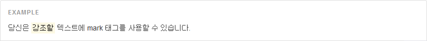
~~~
당신은 <mark>강조할</mark> 텍스트에 mark 태그를 사용할 수 있습니다.
~~~
#### [5.3.2.](#TOC) <a id="5.3.2.">삭제된 텍스트</a>
텍스트 블록이 삭제 되었음을 나타내기 위해서는 `<del>` 태그를 사용하세요
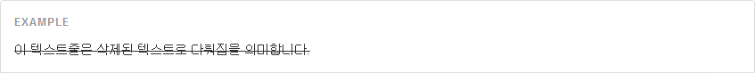
~~~
<del>이 텍스트줄은 삭제된 텍스트로 다뤄짐을 의미합니다.</del>
~~~
#### [5.3.3.](#TOC) <a id="5.3.3.">취소선 텍스트</a>
텍스트 블록이 더 이상상 연관이 없음을 나타내기 위해서 `<s>` 태그를 사용하세요.
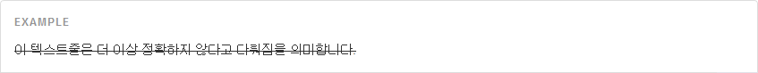
~~~
<s>이 텍스트줄은 더 이상 정확하지 않다고 다뤄짐을 의미합니다.</s>
~~~
#### [5.3.4.](#TOC) <a id="5.3.4.">삽입된 텍스트</a>
문서에 추가됨을 나타내기 위해서 `<ins>` 태그를 사용하세요.
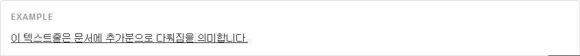
~~~
<ins>이 텍스트줄은 문서에 추가분으로 다뤄짐을 의미합니다.</ins>
~~~
#### [5.3.5.](#TOC) <a id="5.3.5.">밑줄친 텍스트</a>
텍스트에 밑출을 치려면 `<u>` 태그를 사용하세요.
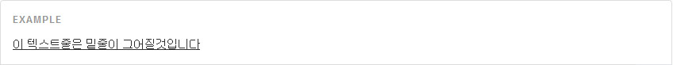
~~~
<u>이 텍스트줄은 밑줄이 그어질것입니다</u>
~~~
#### [5.3.6.](#TOC) <a id="5.3.6.">작은 텍스트</a>
텍스트 인라인이나 블록을 덜 강조하기 위해, 부모 태그보다 85% 의 크기로 보여지게 하는 `<small>` 태그를 사용하세요. 제목 요소는 내포된 `<small>` 요소를 위한 그들만의 font-size 를 가지고 있습니다.
당신은 `<small>` 대신 인라인 요소에 .small 을 사용할 수 있습니다.
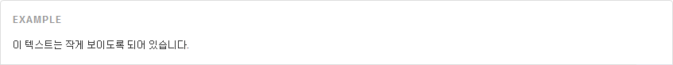
~~~
<small>이 텍스트는 작게 보이도록 되어 있습니다.</small>
~~~

#### [5.3.7.](#TOC) <a id="5.3.7.">두껍게</a>
폰트 두께를 두껍게 하여 텍스트를 강조합니다.
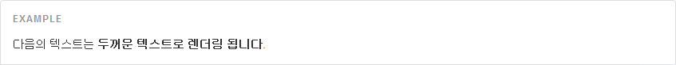
~~~
<strong>두꺼운 텍스트로 렌더링 됩니다</strong>
~~~