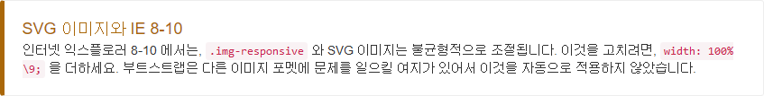
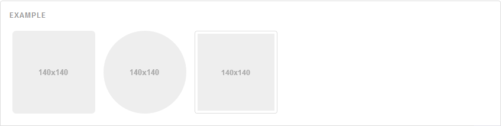

 

# MIT 허가서 (라이센스 관련 글)

 

   ~~~ 
    - MIT 허가서 내용

    -MIT 규정 (MIT)

    Copyright (c) 2011-2016 Twitter, Inc.

    모든 사람이 허가를 얻었습니다.
    
    이 소프트웨어 및 관련 문서 파일 ( "소프트웨어")
    
    software restriction
    
    병합, 게시, 배포, 재판매 및 / 또는 판매 행위
    
    소프트웨어의 사본, 소프트웨어가있는 사람
    
    다음 조건부 블랙리스트 가구 :

    위의 저작권 고지 승낙 고지가 있습니다.
    
    소프트웨어의 모든 사본 또는 부분.

    소프트웨어는 "유능한"보증 계급의 보증을 제공합니다.
    
    상품성, 목적 성 및 목적 적합성
    
    목적 및 비 침습성. programse
    
    저자 또는 사본 보유자는 모든 법, 손해 또는 기타
    
    책임, 계약 행위, 불법 또는 기타 로사검,
    
    소프트웨어 또는 사용과 관련하여 생성 또는 사용 된 기타
    
    소프트웨어.
    
    -요약
    
     - 이 소프트웨어를 누구라도 무상으로 제한없이 취급해도 좋다. 단, 
     저작권 표시 및 이 허가 표시를 소프트웨어의 모든 복제물 또는 중요한 부분에 기재해야 한다.
    
     - 저자 또는 저작권자는 소프트웨어에 관해서 아무런 책임을 지지 않는다.
        
    - 자세한 내용 참조 :  https://github.com/twbs/bootstrap/blob/master/LICENSE

    
    bootstrap은 기초 기능들 초기 모델 등은 MIT에서 제작 되었으며 저작권은 twitter에 있다. 오픈소스라고 하나 
    몇 가지 규칙이 있으며 이를 잘 숙지해야한다. 다음은 그 몇 가지를 다루는 예시 이다.

    bootstrap 사용 시 해야 될 것

    bootstrap을 사용하게 되면 각 해당 소스의 맨 위에 주석처리로 
    CSS와bootstrap JavaScript의 라이센스 내용을 공지해 둬야한다.

    bootstrap 사용 시 허용되는 것

    bootstrap을 사용하게 되면 개인용 이든 상업용이든 자유롭게 배포를 할 수 있고 소스수정이 가능합니다.
    즉 어지간한 것들은 허용이 됩니다.

    bootstrap 사용 시 제한 되는 것

    bootstrap은 자유롭기 때문에 배포에 의한 피해 이러한 것을 책임지지 않기 때문에 주의 해야하며 저작권이 twitter
    에게 있는데 bootstrap을 사용하면서 막 twitter를 자기가 만들었다 이런 식 등 twitter에 피해가 갈법한 행위는 
    하면 아니되며 twitter 아이콘을 변경해서는 아니된다.

    bootstrap 사용 시 안해도 되는 것

    bootstrap을 사용했는데 새로운 버전의 bootstrap이 나와도 서로 상호의존이 가능하게끔 패치를 할 것이니 
    bootstrap을 사용한 개발자들은굳이 bootstrap 패치를 할 필요가 없다. 그리고 bootstrap을 사용하는데 그것을
    개인용의 목적이든 상업용의 목적이든 수정을 하게 된다면 수정 된 사항들을 bootstrap 제작 팀이나
    twitter에 보고를 할 필요는 없다. 다만 보고(피드백)을 해주는 것이 다음 bootstrap 패치에 여러가지 도움이 된다.
   ~~~
---
## 이미지
### 반응형 이미지 
##### 부트스트랩 3 의 이미지들은 .img-responsive 으로 반응형으로 만들수 있습니다. 이것은 이미지에 max-width: 100%;, height: auto; , display: block; 을 적용합니다. 그래서 그것은 부모요소에 알맞게 변화합니다.
##### .img-responsive 를 사용한 이미지를 가운데 두기 위해서, .text-center 대신 .center-block 를 사용하세요. .center-block 사용에 관해 자세한 것은 헬퍼 클래스 섹션을 보세요.

~~~

~~~
---
### 이미지 모양
##### 프로젝트에 손쉽게 스타일된 이미지를 위해서  요소에 클래스를 추가하세요. 

~~~

~~~
---

