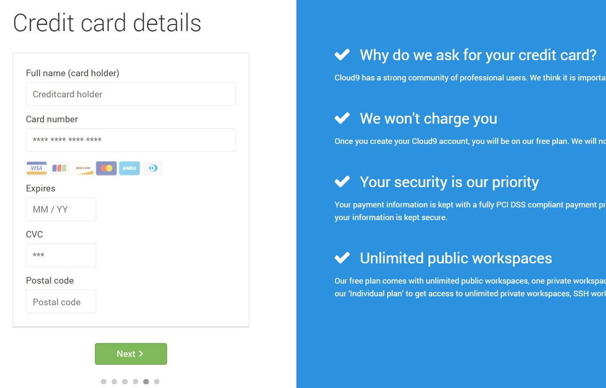
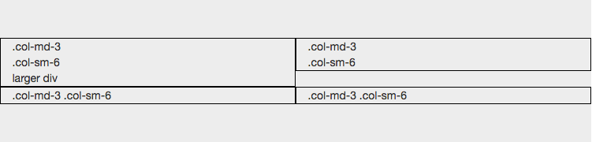
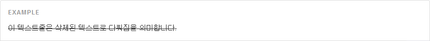
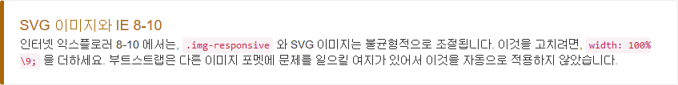
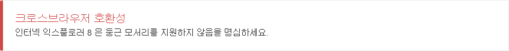

 # 오픈소스 SW Report
 
 
 

#   작성자

    * 20155005 손성호

          - bootstrap 이란?

          - bootstrap 초기 환경 설정

          - 가상 개발 도구 C9

    * 20155008 김진모

          - bootstrap CSS

          - bootstrap Grid

          - bootstrap FONT

    * 20155009 김도현

          - MIT 허가서 (라이센서에 대한 정보)

          - bootstrap IMG

  
  

#   머릿글
 
        저희 팀은 오프소스 중 bootstrap에 대한 메뉴얼을 만들 것 입니다.제작 동기는 여러 웹 개발자들이 bootstrap을 많이 이용하나 대부분의 문서가 영문으로 되어있으며 모음집처럼 자세히 되어있는 것이 없어서 제작을 하고자 합니다. 주로 다룬 것은 bootstrap의 큰 기능들을 초보자가 쉽게 접근하는 것에 목적을 두었습니다.

 
 
 

#      목차
 

        - bootstrap 이란?

        - bootstrap 초기 환경 설정

        - 가상 개발 도구 C9

        - bootstrap CSS

        - bootstrap Grid

        - bootstrap Font

        - bootstrap  Image

        - MIT 허가서 (라이센서에 대한 정보)

        - 기능 향상을 위한 제안

        
    
# Bootstrap 이란?
---
 
 

일종의 양식 비슷한 것으로  웹 페이지를 제작 할 때 Front-end 부분에서 도움이 되는 것이다.Front-end는 웹 페이지를 인간의 시각에서 볼 때 보이는 것들로 이를 보기 쉽게 제작하기 위해선 여러 가지 손이 많이 가게 되는데 bootstrap은 이러한 것들을 미리 만들어주어 웹 페이지 제작자에게 도움이 되는 오픈소스이다. HTML 5 기반의 웹 프레임워크 오픈소스이며 JavaScript 와 CSS를 섞어 놓은 것으로 디자이너들에겐 혁명적인 오픈소스이다. 웹에서 사용되는 정말 많은 기능들을 내포하고 있으며 강력한 그리드 기능을 통하여 안드로이드,맥북,노트북,데스크톱 등에서 봤을때에도 화면의 크기가 변하지 않는다.(반응형 기능) 라이센스 부분도 GPL이 아닌 MIT허가서에 의존하여 GPL보다 훨씬 더 자유로우며 소스자체도 공개 되어 있어서 사용자의 입맛에 따라 바꿀 수 있다는 것이 강점이다.
    
# Bootstrap 환경 구성
---
 
큰 순서는 인터넷에서 BootStrap설치 → 컴파일러 설치 이렇게이다. 
우선 Google에 'Bootstrap 다운로드'를 검색하면 쉽게 다운받을 수 있다. bootstrap은  Javascript를 사용하기 때문에 JQuery를 설치가 되어있어야 한다. Google에서 검색을 해서 다운로드하면 주로 압축형태로 설치되는데 이를 간단히 풀어보면 아래 그림과 같다. 

----
    ↓  압출폴더의 전개도

    bootstrap/
    ├── css/
    │   ├── bootstrap.css
    │   ├── bootstrap.css.map
    │   ├── bootstrap.min.css
    │   ├── bootstrap-theme.css
    │   ├── bootstrap-theme.css.map
    │   └── bootstrap-theme.min.css
    ├── js/
    │   ├── bootstrap.js
    │   └── bootstrap.min.js
    └── fonts/
    │    ├── glyphicons-halflings-regular.eot 
    │    ├── glyphicons-halflings-regular.svg 
    │    ├── glyphicons-halflings-regular.ttf
    │    ├── glyphicons-halflings-regular.woff
    │    └── glyphicons-halflings-regular.woff2
    ├── less/
    ├── js/
    ├── fonts/
    ├── dist/
    │   ├── css/
    │   ├── js/
    │   └── fonts/
    └── docs/
        └── examples/
---
 배포된 소스마다 어느 정도 차이가 있겠지만 대체적으로 이러한 구조를 지니고 있다. 간단히 설명하자면 less/, js/, fonts/ 는 CSS, JS, 아이콘 폰트를 위한 각각의 소스 코드 이며 dist/ 폴더는 모든 것을 프리컴파일된 다운로드 섹션 상에 목록을 모두 포함한다. docs/ 폴더는 우리의 문서와 부트스트랩 사용예제 examples/ 의 코드를 포함한다. 그밖에, 다른 포함된 파일들은 패키지, 라이센스 정보, 개발을 지원을 제공하게 이루어져 있다.   이제 이 폴더를 어떻게 사용하는지 설명하겠다. 이제 이 폴더를 실행시켜줘야 하는데 이를 간단하게 '컴파일'이라고 한다. 저것들은 서로 연결되어 있는데 이를 완벽히 링크해주어 시각적으로 보이게 해주는 것이다. 이를 위해서 Node.js 가 필요하다. Node.js는  서버를 구축하게 해주는 것이다. 간단히 설명하면  Node.js를 설치하고 안에서 경로를 위에 다운 받은 Bootstrap 폴더로 경로를 잡아준 후에 Run을 돌려주면 된다. Chrome이라던지 Explorer에 자기자신의 ip를 적어주면 bootstrap이 가동된 상태를 확인 할 수 있다.(일종의 Free View)라고 볼 수 있는데 안에 소스 변경에 따라 웹 페이지가 바뀌는 것을 눈으로 확인 할 수 있다. 이렇게 작업을 하면서 변경 할 수 있다.

 
 
 

# 가상 개발 도구 C9

- 앞에서 말한 환경구축에서 Node.js를 이용해서 하는 방법도 있지만 이는 다른 사람들과 협업을 할 때 여러 문제가 생긴다. Github을 이용한 소스 공유도 있지만 이는 일반 E-mail로도 할 수 있는 일들이다. 더욱 더 효과적인 작업을 할려면 가상 개발 도구 C9을 이용해서 할 수 있다. C9은 부분유료화 Tool로써 가상 개발 환경을 구축한다. 심지어 원격 저장소의 기능도 하기 때문에 협업을 할 때도 상당히 편하다. 대부분 bootstrap을 이용한 작업을 하게되면 C9으로 하는 것이 훨씬 편할 것이다. 협업에 특화되어 있고 바로 호스팅도 가능하기 때문에 실시간으로 현재 사이트의 상태를 확인 할 수가 있다.
 
 
 
    - 차례  
          
       -C9 회원 가입
        
        

       -C9 환경 구축
        
   -C9 협업 방법
        
     -C9 bootstrap 적용
 
 
    - 주의 사항
 
 

   1. C9 회원가입
 
 
    - http://c9.io 가 C9의 공식 주소이다. 우선 회원가입을 해주면된다. 하지만 회원 가입시 VISA카드가 필요하니 꼭 챙겨야 하며 우편번호가 필요하다. 우편번호는 해당 C9이 주소를 확인 할 때 필요하기 때문이다.

 
 
    -  ↓C9의 초기화면
 
 

   

 
 

-  ↓ C9의 회원가입 시 VISA카드 제시 화면

 
 

   

  

    2. C9 환경구축
 
    - 회원가입이 되었다면 이제 생성을 해보면 되는데 간단히 설명하면 작은 서버를 하나 만드는 것과 같다.
  

-  ↓ C9 Workspace 구축 장면(Create a new Workspace+ 를 눌러주면된다)
 
 

   
  
 
-  ↓ C9 Workspace 구축 장면(공개 권한 및 사용할 랭귀지 등을 설정 할 수 있다.)
   
   
   
-  ↓ C9 Workspace 구축 장면(Create workspace를 누르면 가상 서버가 구축 중인 상태)   

   
   
-  ↓ C9 Workspace 구축 완료(구축 후 간단한 HTML언어를 사용하여 소스입력)   

   
   

   3. C9 협업 방법   

    - 현재는 이제 간단한 가상 서버 환경 구축과 간단한 소스 입력을 해보았으나 사실 상 1인 개발은 힘들기 때문에 협업을 하게 되는데 이러한 협업에 관한 설명을 아래에서 다룬다.미리 하나 기본형으로 만들어 둔 뒤에 동료의 C9 계정을 추가하여 권한을 부여하는 것이 일반적인 방법이다. 
        
    * 아래 사진은 이미 기본형을 만들고 동료의 계정 까지 추가한 상태이다.
   
-  ↓ C9 Workspace 협업하기(기본 탭에서 Shared With Me를 클릭)
   

   

   
-  ↓ C9 Workspace 협업하기(아래와 같이 소스를 입력하면 실시간으로 코드 라인 숫자 옆에 색상으로 누가 코드를 작성했는지 알 수 있게 되어있으며 마우스를 대고 있으면 해당 작성자의 이름이 나온다.)
 
 

   
   
   4. bootstrap

    - 앞의 내용을 읽어 보았다면 현재 bootstrap 파일들이 pc에는 설치 되어있지만 C9의 가상 환경에는 적용이 되어있지 않은 상태이다. 이러한 상태에서 설명한다.
 
    -  ↓ C9 Workspace bootstrap 적용하기(몹시 간단하다 설치된 파일들을 드래그 해서 해당 기본 탭에 넣어주면 된다.)
   

   
   
    -  ↓ C9 Workspace bootstrap 적용하기(동료들과 소스를 만든 후 지금의 상태를 확인하고 싶다면 위에 RUN이라고 적힌 버튼을 클릭하면 서버가 구동된다. 그리고 콘솔 창이 아래와 같이 변한다.)
  
   
        
    -  ↑ C9 Workspace bootstrap 적용하기(위 와같이 변하면 링크가 하나 생기는데 이것이 가상 호스팅인데 저 것을 클릭하면 현재 상태를 확인 할 수있다. 또한 저 콘솔 창에 여러가지 명령어로 Back-end 부분 명령을 내릴 수 도 있다.)
   
    -  ↓ C9 Workspace bootstrap 적용하기( 아래는 CSS,HTML등 소스를 입력 후 Run을 돌렸을때의 모습이다.)
   
   
       
-  ↑ 위의 사진은 직접 제작한 사이트 이기 때문에 문제가 없습니다.
   
- 주의 사항 
   
우선 기본적인 환경 구성을 작성 하였으나. 우선 C9 기능을 사용하기 위해선 어느 정도 PC의 사양이 받쳐주어야 한다. 그리고 충분한 개발 언어의 숙련도만 있으면 쉽게 이용 할 수 있다.

 
**목차** 
---
  * [1.](#1.) CSS
    * [1.1.](#1.1.) CSS 기본설정
    * [1.2.](#1.2.) 모바일 우선기능
    * [1.3.](#1.3.) CSS 사용
  * [2.](#2.) bootstrap CSS 기반
    * [2.1.](#2.1.) LESS
  * [3.](#3.) Bootstrap 프레임워크 CSS 기능
  * [4.](#4.) 그리드 시스템
    * [4.1.](#4.1.) Bootstrap의 그리드 시스템의 작동 방식
    * [4.2.](#4.2.) 그리드 시스템 응용
       * [4.2.1.](#4.2.1.)그리드 시스템 응용(- visble-*)
       * [4.2.2.](#4.2.2.)그리드 시스템 응용(- clearfix)
       * [4.2.3.](#4.2.3.)그리드 시스템 응용(- offset)
       * [4.2.4.](#4.2.4.)그리드 시스템 응용(pull, push)
  * [5.](#5.) Font
    * [5.1.](#5.1.) 부트스트랩의 Font-size기본값
    * [5.2.](#5.2.) Less 로 만들어진
    * [5.3.](#5.3.) 인라인 텍스트 요소
      * [5.3.1.](#5.3.1.) 표시된 텍스트
      * [5.3.2.](#5.3.2.) 삭제된 텍스트
      * [5.3.3.](#5.3.3.) Less 로 만들어진
      * [5.3.4.](#5.3.4.) 삽입된 텍스트
      * [5.3.5.](#5.3.5.) 밑줄친 텍스트
      * [5.3.6.](#5.3.6.) 작은 텍스트
      * [5.3.7.](#5.3.7.) 두껍게
      * [5.3.8.](#5.3.8.) 이탤릭
    * [5.4.](#5.4.) 정렬 클래스
    * [5.5.](#5.5.) 변형 클래스
    * [5.6.](#5.6.) 변형 클래스
      * [5.6.1.](#5.6.1.) 기본 약어
      * [5.6.2.](#5.6.2.) 기본 약어
    * [5.7.](#5.7.) 주소
    * [5.8.](#5.8.) 인용구
    * [5.9.](#5.9.) 기본 인용구
      * [5.9.1.](#5.9.1.) 순서없는
      * [5.9.2.](#5.9.2.) 순서있는
      * [5.9.3.](#5.9.3.) 스타일 없는
      * [5.9.4.](#5.9.4.) 인라인
      * [5.9.5.](#5.9.5.) 설명
      * [5.9.6.](#5.9.6.) 수평 설명
 
---

## [1.](#TOC) <a id="1.">CSS</a>
##### CSS 기능을 이용하기 위해서는 기본적으로 HTML5를 사용해야 한다.

### [1.1.](#TOC) <a id="1.1.">CSS 기본설정</a>
##### 그러기 위해서는 DOCTYPE에 대해서 HTML5로 정의해야 한다. 가장 위에 문서 양식은 아래와 같이 정의하면 사용할수 있다..
~~~ 
<!DOCTYPE html>
~~~
### [1.2.](#TOC) <a id="1.2.">모바일 우선기능</a>
##### 그리고 Bootstrap 2에서는 모바일은 옵션으로 다루고 있었지만, Bootstrap 3에서는 모바일 우선(mobile first)인 프레임워크로 작성이 되었기 때문에 뷰포트에 대한 메타태그 설정을 하면 좋다. 물론 사이트에 따라서 이러한 뷰포트는 다르게 설정을 해도 되며, 기존의 사이트에 적용하는 경우에는 모바일에 대한 화면의 크기가 달라지기 때문에 예상하지 못하는 문제가 발생할 수 있으므로 조심해야 한다.
~~~
<meta name="viewport" content="width=device-width, initial-scale=1">
~~~
### [1.3.](#TOC) <a id="1.3.">CSS 사용</a>
##### 이후에 ``<head>`` 태그 안에서 CSS 파일을 link 시키면 기본적인 CSS 기능들은 사용할 수 있다. 아래는 CDN에 있는 Bootstrap CSS 파일을 사용하는 것으로, 필요하면 개별적으로 서버에서 다운 받아서 사용하면 된다.
~~~
<link rel="stylesheet" href="https://maxcdn.bootstrapcdn.com/bootstrap/3.3.6/css/bootstrap.min.css" integrity="sha384-1q8mTJOASx8j1Au+a5WDVnPi2lkFfwwEAa8hDDdjZlpLegxhjVME1fgjWPGmkzs7" crossorigin="anonymous">
~~~

 

### [2.](#TOC) <a id=2.>bootstrap CSS 기반</a>
#####   부트스트랩의 CSS 는 Less 를 기반으로 만들어졌습니다. Less 는 CSS 컴파일링을 위한 변수, 믹스인, 함수 같은 부가 기능성을 갖춘 프리프로세서입니다. 컴파일된 CSS 파일들 대신 우리가 프레임워크 내에서 사용한 수많은 변수들과 믹스인들을 활용하는 Less 파일들을 사용하는 것을 고려해 보아야합니다.

### [2.1.](#TOC) <a id=2.1.>LESS</a>
 ##### css는 html을 꾸며주는 언어입니다. 하지만 단점도 있는데요. 이를테면 작성하기는 쉽지만, firebug와 같은 도구 없이는 유지보수하는 것이 매우 어렵습니다. 또 동적인 언어의 특징인 변수나 함수와 같은 특성을 가지고 있지 않기 때문에 많은 양의 코드가 동원되기도 합니다. 이러한 문제를 해결하기 위해서 기술 중의 하나가 lesscss입니다. lesscss를 보다 간결하고 유지보수하기 쉬운 css를 만들 수 있습니다.
>LESS는 NodeJS를 엔진으로 사용한다

 

## [3.](#TOC) <a id="3.">Bootstrap 프레임워크 CSS 기능</a>
##### Bootstrap 프레임워크의 CSS 기능은 웹페이지에 적용하게 되는 CSS 규칙들을 기본적으로 설정하고, 기본 HTML 요소들에 대한 스타일을 적용하는 기능들을 포함하고 있다. 특히, Bootstrap 프레임워크에서 제공해주고 있는 반응형 웹페이지의 가장 큰 기능인 그리드 형식으로 여러 칼럼으로 보여주다가 브라우져의 크기가 작아지면 세로로 나열시키는 기능을 이 CSS 기능에서 적용하면 된다. 양식이나 버튼들에 대해서도 다양한 CSS 설정을 기본적으로 해주니 기본 UI 디자인에서 조금 더 향상된 CSS를 체험할 수 있다.

 

## [4.](#TOC) <a id="4.">그리드 시스템</a>
#### Bootstrap은 기기나 뷰포트 크기가 증가함에 따라 12 열이 적절하게 확대되는 **반응형**, **모바일 우선** 유동 그리드 시스템입니다. 그것은 쉬운 레이아웃을 위해 미리 정해진 클래스들 뿐만 아니라 강력한 더 시멘틱한 레이아웃을 생성하기 위한 믹스인 을 포함하고 있습니다. 
> 그리드 시스템은 콘텐츠를 보관할 행과 열 시리즈를 통해 페이지 레이아웃들 만드는데 사용되어집니다.  

### [4.1.](#TOC) <a id="4.1.">Bootstrap의 그리드 시스템의 작동 방식</a>
- 행은 반드시 적절한 정렬과 패딩을 위해서 .container (fixed-width) 나 .container-fluid (full-width) 안에 위치해야 합니다.
- 열들의 수평그룹을 만드는데 행을 이용하세요.
- 콘텐츠는 열안에 위치해야 합니다. 그리고 열들만이 행의 바로 아래에 올 수 있습니다.
- .row 과 .col-xs-4 같은 사전정의된 그리드 클래스들은 간편하게 그리드 레이아웃 만드는 것을 가능하게 합니다. Less 믹스인은 좀 더 시멘틱한 레이아웃을 위해 사용되어질 수 있습니다.
- 열은 padding 으로 사이 간격을 만듭니다. 패딩은 행 내에서 첫열과 마지막열을 위해 .row 내에 음수 마진으로 offset 되어 있습니다.
- 음수 마진은 아래의 예제들이 내어쓰기가 되어 있는 이유입니다. 그것은 그리드 열 내의 콘텐츠는 비그리드 콘텐츠와 정렬되기 위함입니다.
- 그리드 열은 12개의 가능한 열들을 원하는 만큼 명시하는 것으로 만들어집니다. 예를 들면, 같은 크기의 3개 열은 .col-xs-4 를 3개 사용할 수 있습니다.
- 만약 한 행에 12열보다 더 많이 배치된다면, 남은 열들은, 하나의 유닛으로, 새로운 라인에 감싸집니다.
- 그리드 클래스는 분기점 크기보다 크거나 같은 너비의 화면을 가진 기기에 적용됩니다. 그리고 보다 작은 기기의 그리드 클래스가 오버라이드 됩니다. 그리하여, 예를 들어 요소에 .col-md-* 클래스를 적용하는 것은 중간 기기에 스타일이 효과가 있는 것뿐만 아니라 .col-lg-* 클래스가 없다면 큰 기기에도 효과가 있게 됩니다.

### [4.2.](#TOC) <a id="4.2.">그리드 시스템 응용</a>
##### 위의 row와 col-*은 기본적으로 그리드 시스템에서 사용하면서 발생하는 다양한 추가적인 이슈나 문제들에 대해서 추가적인 기능들을 제공해주고 있습니다. 가장 대표적인 상황이 큰 화면에서는 보여주지만, 작은 화면에서 보여주고 싶지 않은 내용일 것이다. 예를 들어 큰 화면에서는 큰 그림을 보여주지만, 작은 화면에서는 보여주고 싶지 않을 때 이러한 기능을 이용하면 된다. 

### [4.2.1.](#TOC) <a id="4.2.1.">그리드 시스템 응용(- visble-*)</a>
> ###### 아래의 예는 큰 화면에서는 4개의 칼럼으로 보여주다가, 작은 화면에서는 3개의 칼럼만 보여주고자하는 예의 소스이다. 이 경우에는 visible-md 등과 같이 해당 칼럼을 보여주고자 하는 크기를 지정해주면 된다.
~~~
 

  

    
.col-md-3 .col-sm-4
 
    
.col-md-3 .col-sm-4
 
    
.col-md-3 .col-sm-4
 
    
.col-md-3 .visible-md
 
  
 

~~~
##### 위의 소스를 큰 화면에서 보면 아래와 같이 4개의 칼럼이 전부다 나타나는 것을 확인할 수 있다.

##### 그리고 브라우져의 크기를 줄여보면 아래와 같이 visible-md의 클래스를 설정하였던 칼럼은 없어지고, 나머지 3개의 칼럼만 보여주는 것을 확인할 수 있다. 이 때에 3개의 칼럼을 화면 전체 넓이에 맞게 보여주기 위하여 col-sm-4로 작은 화면에서는 3칼럼으로 보여주도록 함께 설정하였다.

### [4.2.2.](#TOC) <a id="4.2.2.">그리드 시스템 응용(- clearfix)</a>
##### 반응형으로 넓은 화면에서는 여러 개의 칼럼을 하나의 줄로 보여주다가 좁은 화면에서 여러 줄로 나누어서 보여주게 되는 경우 세로 길이가 다르면 약간 어긋나는 상황이 많이 있을 것이다. 대표적인 예가, 큰 화면에서 4칼럼으로 한줄로 보여주다가 작은 화면에서 2칼럼으로 2줄로 보여주는 상황일 것이다. 아래가 그 예이다. 아래는 예 소스이다.

~~~
        

            

                
.col-md-3
.col-sm-6
larger div

                
.col-md-3
.col-sm-6

                
.col-md-3 .col-sm-6

                
.col-md-3 .col-sm-6

            

        

~~~
##### 결과값 : 

~~~
.clearfix:before, 
.clearfix:after,
 /* 생략 */ {
    display: table;
    content: " "; 
} 
 .clearfix:after,
 /* 생략 */ {
    clear: both; 
}
~~~
##### 위와 같이 CSS를 설정하게 되면, CSS의 흐름이 초기화 되도록 하는 방법이다. 이렇게 clearfix를 이용해서 위의 어긋난 칼럼들을 보정하려면 아래와 같이 sm인 경우에 보이도록 하면 된다. 
###### 이를 보정한 예는 아래와 같다.
~~~
        

            

                
.col-md-3
.col-sm-6
larger div

                
.col-md-3
.col-sm-6

                

                
.col-md-3 .col-sm-6

                
.col-md-3 .col-sm-6

            

        

~~~
##### 위와 같이 브라우져크기가 sm 인 경우에만 clearfix를 설정한 
가 보이도록 하고 있다. 이렇게 되면 아래와 같이 작은 브라우져 화면인 경우에 위와는 다르게 어긋나지 않고 윗줄이 동일하게 맞추어졌음을 확인할 수 있다.

### [4.2.3.](#TOC) <a id="4.2.3.">그리드 시스템 응용(- offset)</a>
##### 칼럼의 왼쪽에 공백을 두고 싶다면 그냥 빈 공백의 `
`를 공백을 두고 싶은 만큼 col-xs-*등을 넣어도 되지만, 이러한 공백의 `
`가 아니라 스타일을 적용함으로써 공백을 둘수도 있다. 이를 위해서 col-sm-offset-1 등과 같이 offset 클래스를 이용하면 된다. 아래는 1개의 칼럼만큼 공백을 두고 5칼럼 크기 만큼을 할당하는 예이다.
~~~

 
  

    
.col-sm-5 .col-sm-offset-1
 
    
.col-sm-5 .col-sm-offset-1
 
  
 

~~~
#####  위는 1칼럼 offset, 5칼럼 내용, 1칼럼 offset, 5칼럼 내용을 넣는 소스이며, 실제로 표시해보면 아래와 같이 작은 화면 이상에서는 그렇게 나타나고 작은 화면에서는 세로로 배치되는 것을 확인할 수 있다.

### [4.2.4.](#TOC) <a id="4.2.4.">그리드 시스템 응용(pull, push)</a>
##### 화면의 크기에 따라서 순서를 바꿔주고 싶다면 pull과 push 클래스를 이용하면 된다. 위의 offset과는 유사하지만, 용도와 내부적인 CSS는 조금 다르다. 
###### 아래는 화면이 md 크기 이상일 때와 sm이하인 경우에 칼럼의 순서를 바꿔주고자 하는 경우의 예이다.
~~~
 

  
 
    
.col-sm-9 .col-md-push-3

    
.col-sm-3 .col-md-pull-9

  
 
 

~~~
##### 위의 소스를 보면 sm 화면 이상에서의 9칼럼 크기 칼럼을 md 이상 화면에서는 push-3을 하고 있고, sm 화면 이상에서 3 칼럼 크기의 카럼을 md 이상 화면에서 pull-9를 설정하였다. pull 클래스는 왼쪽으로 칼럼을 당긴다고 생각하면 되고, push는 칼럼을 오른쪽으로 미는 기능이라고 생각하면 된다. 이에 대하여 실제로 col-sm-9가 앞에 있지만, 중간 화면에서는 아래와 같이 col-sm-3 칼럼이 앞에 있는 것을 확인할 수 있다.

### [5.](#TOC)<a id="5.">Font</a>
##### 모든 HTML 제목인, `<h1>` 부터 `<h6>` 까지 사용가능합니다. 당신의 텍스트를 인라인으로 표시되면서 스타일만 제목 스타일로 맞추기 위해 `.h1` 부터 `.h6` 클래스 또한 사용 가능합니다.

~~~
<h1>h1. Bootstrap heading</h1>
<h2>h2. Bootstrap heading</h2>
<h3>h3. Bootstrap heading</h3>
<h4>h4. Bootstrap heading</h4>
<h5>h5. Bootstrap heading</h5>
<h6>h6. Bootstrap heading</h6>
~~~

~~~
<h1>h1. Bootstrap heading <small>Secondary text</small></h1>
<h2>h2. Bootstrap heading <small>Secondary text</small></h2>
<h3>h3. Bootstrap heading <small>Secondary text</small></h3>
<h4>h4. Bootstrap heading <small>Secondary text</small></h4>
<h5>h5. Bootstrap heading <small>Secondary text</small></h5>
<h6>h6. Bootstrap heading <small>Secondary text</small></h6>
~~~
### [5.1.](#TOC) <a id="5.1.">부트스트랩의 Font-size기본값</a>
##### 부트스트랩의 font-size 기본값은 14px 이고, line-height 는 1.428 입니다. 이것은 <body> 와 모든 단락에 적용됩니다. 추가로, `
` (단락) 은 행높이의 절반의 하단 마진을 가집니다.(기본값에 의하면 10px 로 계산됩니다).

### [5.2.](#TOC) <a id="5.2.">Less 로 만들어진</a>
##### 문자크기는 variables.less 에서의 두 LESS 변수(@font-size-base 와 @line-height-base) 에 기반됩니다. 첫번째 변수는 기본 폰트 크기이고 두번째 변수는 기본 행 높이입니다. 타이포그래피에서 마진, 패딩, 행 높이를 구하기 위해 두 변수와 몇 개의 간단한 수학을 사용합니다.

### [5.3.](#TOC) <a id="5.3.">인라인 텍스트 요소</a>
#### [5.3.1.](#TOC) <a id="5.3.1.">표시된 텍스트</a>
###### 또다른 맥락에서 관련있는 텍스트들을 찾아내어 강조하기 위해, `<mark>` 태그를 사용하세요. 

~~~
당신은 <mark>강조할</mark> 텍스트에 mark 태그를 사용할 수 있습니다.
~~~
#### [5.3.2.](#TOC) <a id="5.3.2.">삭제된 텍스트</a>
###### 텍스트 블록이 삭제 되었음을 나타내기 위해서는 `<del>` 태그를 사용하세요

~~~
<del>이 텍스트줄은 삭제된 텍스트로 다뤄짐을 의미합니다.</del>
~~~
#### [5.3.3.](#TOC) <a id="5.3.3.">취소선 텍스트</a>
###### 텍스트 블록이 더 이상상 연관이 없음을 나타내기 위해서 `<s>` 태그를 사용하세요.

~~~
<s>이 텍스트줄은 더 이상 정확하지 않다고 다뤄짐을 의미합니다.</s>
~~~
#### [5.3.4.](#TOC) <a id="5.3.4.">삽입된 텍스트</a>
###### 문서에 추가됨을 나타내기 위해서 `<ins>` 태그를 사용하세요.

~~~
<ins>이 텍스트줄은 문서에 추가분으로 다뤄짐을 의미합니다.</ins>
~~~
#### [5.3.5.](#TOC) <a id="5.3.5.">밑줄친 텍스트</a>
###### 텍스트에 밑출을 치려면 `<u>` 태그를 사용하세요.

~~~
<u>이 텍스트줄은 밑줄이 그어질것입니다</u>
~~~
#### [5.3.6.](#TOC) <a id="5.3.6.">작은 텍스트</a>
###### 텍스트 인라인이나 블록을 덜 강조하기 위해, 부모 태그보다 85% 의 크기로 보여지게 하는 `<small>` 태그를 사용하세요. 제목 요소는 내포된 `<small>` 요소를 위한 그들만의 font-size 를 가지고 있습니다.
당신은 `<small>` 대신 인라인 요소에 .small 을 사용할 수 있습니다.

~~~
<small>이 텍스트는 작게 보이도록 되어 있습니다.</small>
~~~

#### [5.3.7.](#TOC) <a id="5.3.7.">두껍게</a>
###### 폰트 두께를 두껍게 하여 텍스트를 강조합니다.

~~~
<strong>두꺼운 텍스트로 렌더링 됩니다</strong>
~~~
#### [5.3.8.](#TOC) <a id="5.3.8.">이탤릭</a>
###### 이탤릭으로 텍스트를 강조합니다.(폰트를 기울립니다.)

~~~
<em>이탤릭체로 렌더링 됩니다</em>
~~~
### [5.4.](#TOC) <a id="5.4.">정렬 클래스</a>
###### 정렬 클래스로 콤포넌트의 텍스트를 손쉽게 재정렬하세요.

~~~

좌측정렬된 텍스트.

중앙정렬된 텍스트.

우측정렬된 텍스트.

양쪽정렬된 텍스트.

그냥 텍스트.

~~~
### [5.5.](#TOC) <a id="5.5.">변형 클래스</a>
###### 콤포넌트의 텍스트를 대소문자 클래스로 변형시킵니다. (한글은 해당사항이 없습니다)

~~~

Lowercased text.

Uppercased text.

Capitalized text.

~~~
### [5.6.](#TOC) <a id="5.6.">변형 클래스</a>
###### `<abbr>` 는 약어나 두문자어를 마우스를 올렸을 때 원래 텍스트를 보여주기 위한 요소입니다. `title` 속성이 있는 약어는 점으로된 밑줄을 가지고 있고 마우스를 올렸을때 물음표 커서가 보여지며, 원래 텍스트를 보여줍니다.

#### [5.6.1.](#TOC) <a id="5.6.1.">기본 약어</a>

~~~
<abbr title="attribute">attr</abbr>
~~~
#### [5.6.2.](#TOC) <a id="5.6.2.">두문자어</a>
###### 미세하게 작은(90%) 폰트크기를 가지려면 .initialism 을 추가하세요.

~~~
<abbr title="HyperText Markup Language" class="initialism">HTML</abbr>
~~~

### [5.7.](#TOC) <a id="5.7.">주소</a>
###### 주소나 이메일 등의 연락처를 보여줍니다. ` ` 로 개행합니다.

~~~
<address>
  <strong>Twitter, Inc.</strong> 
  795 Folsom Ave, Suite 600 
  San Francisco, CA 94107 
  <abbr title="Phone">P:</abbr> (123) 456-7890
</address>

<address>
  <strong>Full Name</strong> 
  <a href="mailto:#">first.last@example.com</a>
</address>
~~~

### [5.8.](#TOC) <a id="5.8.">인용구</a>
##### 당신의 문서안에 다른 출처로부터 인용한 콘텐츠 블록을 위해 사용합니다.
#### [5.8.1.](#TOC) <a id="5.8.1.">기본 인용구</a>
###### 주소나 이메일 등의 연락처를 보여줍니다. ` ` 로 개행합니다.

~~~
<blockquote>
  
Lorem ipsum dolor sit amet, consectetur adipiscing elit. Integer posuere erat a ante.

</blockquote>
~~~
#### [5.8.2.](#TOC) <a id="5.8.2.">인용구 옵션</a>
###### 기본 `<blockquote>` 를 기반으로 간단한 변형을 위해 스타일과 내용을 바꿉니다.
###### 출처 표기
###### 출처를 알수 있게 `<footer>` 태그를 추가하세요. 출처 원천의 이름은 `<cite>` 로 감싸주세요.

~~~
<blockquote>
  
Lorem ipsum dolor sit amet, consectetur adipiscing elit. Integer posuere erat a ante.

  <footer>Someone famous in <cite title="Source Title">Source Title</cite></footer>
</blockquote>
~~~
#### [5.8.3.](#TOC) <a id="5.8.3.">다른 표시</a>
###### 오른쪽 정렬된 인용구를 위해서 .blockquote-reverse 를 추가하세요.

~~~
<blockquote class="blockquote-reverse">
  ...
</blockquote>
~~~

### [5.9.](#TOC) <a id="5.9.">목록</a>
#### [5.9.1.](#TOC) <a id="5.9.1.">순서없는</a>
###### 순서가 명확치 않은 항목들의 목록입니다

~~~
<ul>
  <li>...</li>
</ul>
~~~

#### [5.9.2.](#TOC) <a id="5.9.2.">순서있는</a>
###### 순서가 명확한 항목들의 목록입니다.

~~~
<ol>
  <li>...</li>
</ol>
~~~
#### [5.9.3.](#TOC) <a id="5.9.3.">스타일 없는</a>
###### 항목에서 list-style 과 좌측 마진을 제거하세요. (직접 자식만 ) 이것은 오직 바로 아래 항목들에게만 적용됩니다. 그래서 당신은 중첩된 목록에도 따로 클래스를 추가하여야 합니다.

~~~
<ul class="list-unstyled">
  <li>...</li>
</ul>
~~~
#### [5.9.4.](#TOC) <a id="5.9.4.">인라인</a>
###### display: inline-block; 로 항목들을 한줄에 보여주고 약간의 패딩을 줍니다.

~~~
<ul class="list-inline">
  <li>...</li>
</ul>
~~~
#### [5.9.5.](#TOC) <a id="5.9.5.">설명</a>
###### 연관된 설명들의 목록입니다.

~~~
<dl>
  <dt>...</dt>
  <dd>...</dd>
</dl>
~~~
#### [5.9.6.](#TOC) <a id="5.9.6.">수평 설명</a>
###### `<dl>` 내 용어들과 설명들을 나란히 놓습니다. 기본 `<dl>` 처럼 쌓이는 것부터 시작이지만, 네비게이션 바가 펼쳐지는 때와 같은 타이밍에 다음과 같이 됩니다.

~~~
<dl class="dl-horizontal">
  <dt>...</dt>
  <dd>...</dd>
</dl>
~~~

## 이미지
### 반응형 이미지 
##### 부트스트랩 3 의 이미지들은 .img-responsive 으로 반응형으로 만들수 있습니다. 이것은 이미지에 max-width: 100%;, height: auto; , display: block; 을 적용합니다. 그래서 그것은 부모요소에 알맞게 변화합니다.
##### .img-responsive 를 사용한 이미지를 가운데 두기 위해서, .text-center 대신 .center-block 를 사용하세요. .center-block 사용에 관해 자세한 것은 헬퍼 클래스 섹션을 보세요.

~~~

~~~
---
### 이미지 모양
##### 프로젝트에 손쉽게 스타일된 이미지를 위해서  요소에 클래스를 추가하세요. 

~~~

~~~
---
 

# MIT 허가서 (라이센스 관련 글)

 

   ~~~ 
    - MIT 허가서 내용

    -MIT 규정 (MIT)

    Copyright (c) 2011-2016 Twitter, Inc.

    모든 사람이 허가를 얻었습니다.
    
    이 소프트웨어 및 관련 문서 파일 ( "소프트웨어")
    
    software restriction
    
    병합, 게시, 배포, 재판매 및 / 또는 판매 행위
    
    소프트웨어의 사본, 소프트웨어가있는 사람
    
    다음 조건부 블랙리스트 가구 :

    위의 저작권 고지 승낙 고지가 있습니다.
    
    소프트웨어의 모든 사본 또는 부분.

    소프트웨어는 "유능한"보증 계급의 보증을 제공합니다.
    
    상품성, 목적 성 및 목적 적합성
    
    목적 및 비 침습성. programse
    
    저자 또는 사본 보유자는 모든 법, 손해 또는 기타
    
    책임, 계약 행위, 불법 또는 기타 로사검,
    
    소프트웨어 또는 사용과 관련하여 생성 또는 사용 된 기타
    
    소프트웨어.
    
    -요약
    
     - 이 소프트웨어를 누구라도 무상으로 제한없이 취급해도 좋다. 단, 
     저작권 표시 및 이 허가 표시를 소프트웨어의 모든 복제물 또는 중요한 부분에 기재해야 한다.
    
     - 저자 또는 저작권자는 소프트웨어에 관해서 아무런 책임을 지지 않는다.
        
    - 자세한 내용 참조 :  https://github.com/twbs/bootstrap/blob/master/LICENSE

    
    bootstrap은 기초 기능들 초기 모델 등은 MIT에서 제작 되었으며 저작권은 twitter에 있다. 오픈소스라고 하나 
    몇 가지 규칙이 있으며 이를 잘 숙지해야한다. 다음은 그 몇 가지를 다루는 예시 이다.

    bootstrap 사용 시 해야 될 것

    bootstrap을 사용하게 되면 각 해당 소스의 맨 위에 주석처리로 
    CSS와bootstrap JavaScript의 라이센스 내용을 공지해 둬야한다.

    bootstrap 사용 시 허용되는 것

    bootstrap을 사용하게 되면 개인용 이든 상업용이든 자유롭게 배포를 할 수 있고 소스수정이 가능합니다.
    즉 어지간한 것들은 허용이 됩니다.

    bootstrap 사용 시 제한 되는 것

    bootstrap은 자유롭기 때문에 배포에 의한 피해 이러한 것을 책임지지 않기 때문에 주의 해야하며 저작권이 twitter
    에게 있는데 bootstrap을 사용하면서 막 twitter를 자기가 만들었다 이런 식 등 twitter에 피해가 갈법한 행위는 
    하면 아니되며 twitter 아이콘을 변경해서는 아니된다.

    bootstrap 사용 시 안해도 되는 것

    bootstrap을 사용했는데 새로운 버전의 bootstrap이 나와도 서로 상호의존이 가능하게끔 패치를 할 것이니 
    bootstrap을 사용한 개발자들은굳이 bootstrap 패치를 할 필요가 없다. 그리고 bootstrap을 사용하는데 그것을
    개인용의 목적이든 상업용의 목적이든 수정을 하게 된다면 수정 된 사항들을 bootstrap 제작 팀이나
    twitter에 보고를 할 필요는 없다. 다만 보고(피드백)을 해주는 것이 다음 bootstrap 패치에 여러가지 도움이 된다.
   ~~~
---

# 기능 향상을 위한 제안

 
*Node.js의 불편한 협업 기능을 개선하기 위해 도입된 c9
 

-일반적으로 Web 개발은 협업으로 이루어지게 됩니다. 하지만 Node.js로 소스를 공유하고 매번 주고 보내고 하는 것들이 번거롭기 때문에 실시간으로 자유로운 소스 공유가 가능하며 Web server run기능 을 실행하여 FreeView기능이 있는 것을 찾게 되었습니다. 그렇게 해서 찾은 웹 개발 환경을 지원해주는 서비스가 C9입니다. C9은 가상 개발 도구로서 저희가 개발시에 불편했던 요소들을 개편한 편리한 시스템입니다. bootstrap을 이용한 개발도 있지만 다른 분야의 전체적인  Web 개발의 협업을 쉽게 도와 줄 수 있게 되어있습니다. 사용 방법은 가상 개발 도구 C9 목차에서 확인 할 수 있습니다. 가상 개발 도구 C9은 여러 가지 Workspace 환경을 제공하기 때문에 Front-end 개발자와 Back-end 개발자들도 서로의 개발 Form을 보고 서로의 소스를 이해 할 수 있게 도움을 줍니다. Back-end 개발 시에는 해당 가상 workspace consol창에서 확인이 가능 합니다.

-부트스트랩 에 담겨진 그리드 시스템이란 기능에 대해 생각납니다.
이기능은 부트스트랩에 장점이자 단점인거같은데 그리드를 이용한 레이아웃 편집에 있어 굉장한 틀잡기 기능이긴 하나.
이미 만들어져서 완성형웹으로 XE제로보드/그누보드 같은 오픈소스웹에 전체 틀에 적용시키기에는 힘이들며 부트스트랩을 넣어서 있는기능을 간간히 쓰는정도일뿐 그리드 시스템을 활용하여 쓴다는느낌이 전혀없습니다.
그리드 시스템을 활용하기 위해서는 바닥부터 만들어서 그리드를 적용 시켜 사용해야합니다. 그래서 주로 관리자 페이지에만 사용하는등 활용하고있는 범위가 좁은 수준입니다.
부트스트랩 말고도 기술을 따라 파이어폭스에서 지원하고 파이어폭스에 최적화된 그리드 시스템도 존재합니다.
장점도있지만 부트스트랩 하나를 위해서 웹을 새로만든다던가 그런경우는 적을거라 생각합니다.
